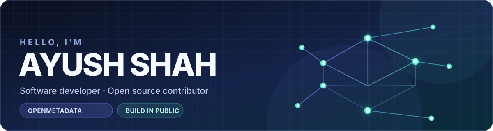
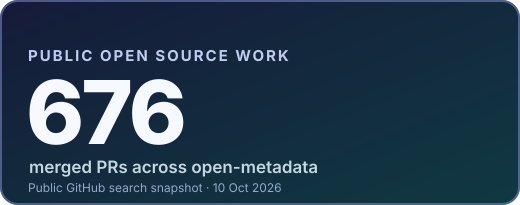
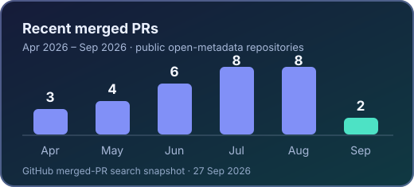

  

<h1 align="center">Backend &amp; Data Platform Engineer</h1>

  I build <strong>metadata ingestion and backend systems</strong> that make data easier to discover, govern, and trust.

  Solutions Engineer at <strong>Deuex</strong> · Working as a Software Engineer with client <a href="https://www.getcollate.io/">Collate</a> on <a href="https://github.com/open-metadata/OpenMetadata">OpenMetadata</a> since 2021

  
  

  

<strong>Data sources → secure ingestion → metadata &amp; lineage → quality &amp; trust</strong>

## What I've built

Selected public contributions. Each link goes to the merged pull request behind the work.

### 01 / Secure ingestion across cloud and identity

Added [AWS RDS IAM authentication for MySQL and PostgreSQL metadata ingestion](https://github.com/open-metadata/OpenMetadata/pull/11937). The change crossed Python connection handling, schema, Java service conversion, tests, and connector docs. I also work with Okta, Google OAuth, Keycloak, and SSO integrations.

### 02 / Data platforms, profiling, and quality

Added [manifest support and profiling improvements for data lake ingestion](https://github.com/open-metadata/OpenMetadata/pull/13017), including S3, GCS, and ADLS readers. Extended [data quality and profiling for Databricks Unity Catalog](https://github.com/open-metadata/OpenMetadata/pull/14424) and improved [BigQuery project discovery, credentials, and nested metadata handling](https://github.com/open-metadata/OpenMetadata/pull/20085). Snowflake is another platform I know in depth.

### 03 / Discovery, dashboards, and lineage

Contributed ingestion connectors for [Tableau](https://github.com/open-metadata/OpenMetadata/pull/468), [Metabase](https://github.com/open-metadata/OpenMetadata/pull/1726), and [Power BI](https://github.com/open-metadata/OpenMetadata/pull/3019), plus [Tableau lineage](https://github.com/open-metadata/OpenMetadata/pull/2850). My metadata work also spans Airflow, Fivetran pipelines, OpenSearch Dashboards, Kafka bootstrap servers, and Schema Registry.

### 04 / Safer backend behavior

Added [validation and a conservative migration for ingestion pipeline configurations](https://github.com/open-metadata/OpenMetadata/pull/29566) across Java and Python. Improved [SQL query safety with parameterized construction and regression coverage](https://github.com/open-metadata/OpenMetadata/pull/24902). Extended the [Python SDK's data contract methods](https://github.com/open-metadata/OpenMetadata/pull/26082).

### 05 / Documentation and developer experience

Built out the public [OpenMetadata demo catalog](https://github.com/open-metadata/openmetadata-demo/pull/73), updated [Python SDK documentation](https://github.com/open-metadata/docs-om/pull/349), clarified [Context Center MCP documentation](https://github.com/open-metadata/docs-om/pull/401), and improved a [release branch GitHub Actions workflow](https://github.com/open-metadata/OpenMetadata/pull/30631). I've also contributed extensively to Collate documentation.

## Technologies I work with

**Backend & search** 
`Python` `Java` `Dropwizard` `Django` `SQL` `OpenSearch` `Elasticsearch` 
Services, SDKs, migrations, query safety, debugging, and root cause analysis.

**Data platforms & metadata** 
`Snowflake` `Databricks` `BigQuery` `Redshift` `Data lakes` `Tableau` `Power BI` `Airflow` `Fivetran` `OpenSearch Dashboards` `Kafka` `Schema Registry` 
Ingestion, profiling, data quality, governance, lineage, observability, discovery, and Context Center.

**Cloud, identity & delivery** 
`AWS RDS` `Glue` `EC2` `ALB` `Secrets Manager` `Systems Manager Parameter Store` `Okta` `Google OAuth` `Keycloak` `SSO` `Docker` `Kubernetes` `GitHub Actions` 
Connecting secure infrastructure to data services and reliable developer workflows.

  

## Open source activity

  

The charts use [GitHub's public merged-PR search](https://github.com/search?q=is%3Apr+author%3Aayush-shah+org%3Aopen-metadata+is%3Apublic+is%3Amerged&type=pullrequests). They count authored PRs merged in public `open-metadata` repositories; they are not a measure of code volume or project ownership. See the [refresh script](./scripts/update_profile_stats.py) and [scheduled workflow](./.github/workflows/update-profile-stats.yml).

  

## Beyond the code

I investigate production issues, run root cause analysis, and ship fixes. I coordinate four support teammates and one documentation teammate, and have contributed heavily to [OpenMetadata documentation](https://github.com/open-metadata/docs-om/pulls?q=is%3Apr+author%3Aayush-shah+is%3Amerged) and Collate documentation. I work with Claude Code and Codex alongside VS Code and IntelliJ IDEA.

Earlier independent projects

- [HousieGame-Tambola](https://github.com/ayush-shah/HousieGame-Tambola) — multiplayer game built with Svelte, Express, and Socket.IO.
- [link-shortener](https://github.com/ayush-shah/link-shortener) — Nuxt/Vue and Express experiment.

  <a href="https://www.linkedin.com/in/shahayushp/">LinkedIn</a> ·
  <a href="https://x.com/aidevatwork">X</a> ·
  <a href="https://github.com/ayush-shah">GitHub</a> ·
  <a href="./RESEARCH.md">Source notes</a>

